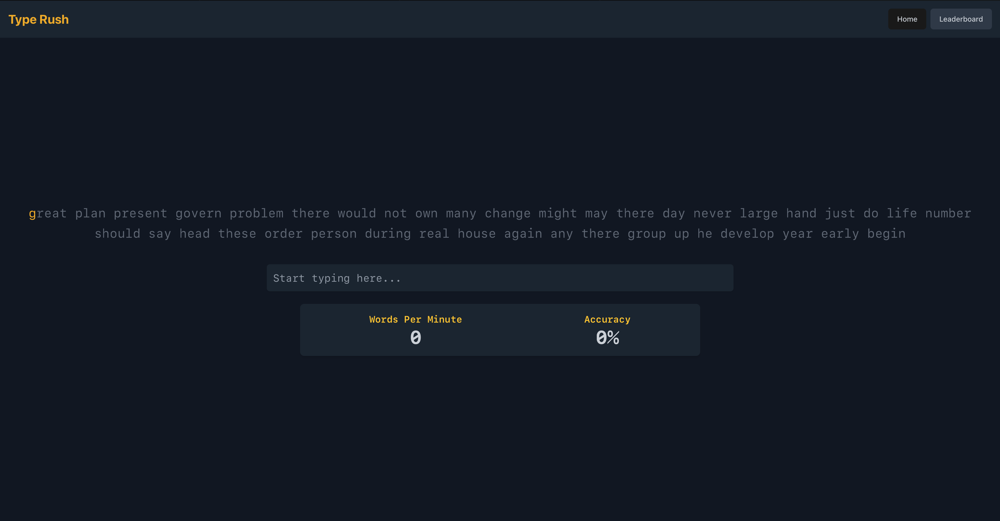

# Type Rush App

**Type Rush** is a modern, responsive typing application that helps users improve their typing speed and accuracy. It features a clean and intuitive user interface.

---

## ✨ Demo

**Live Demo**: [TypeRush](https://typerushapp.netlify.app)


## 🚀 Tech Stack

This project was built using:

- **Frontend**:

  - [React](https://reactjs.org/) - Component-based library for building user interfaces.
  - [TypeScript](https://www.typescriptlang.org/) - Static typing for better code maintainability.
  - [Vite](https://vitejs.dev/) - Fast and modern frontend build tool.
  - [Shadcn UI](https://ui.shadcn.com/) - Styled and customizable components.
  - [React Query](https://tanstack.com/query) - Data fetching and state synchronization.
  - [Tailwind CSS](https://tailwindcss.com/) - Utility-first CSS for responsive and fast UI design.

- **Backend**:

  - Placeholder API or Mock Data - Used to simulate fetching sample text and leaderboard entries.

- **State Management**:
  - [Zustand](https://github.com/pmndrs/zustand) - Lightweight state management library.

---

## ✨ Features

1. **Typing Test**:

   - Displays randomized typing text.
   - Tracks real-time accuracy and words-per-minute (WPM).

2. **Stats Display**:

   - Shows **WPM** and **Accuracy** dynamically during typing.

3. **Leaderboard**:

   - Displays a leaderboard of top performers fetched dynamically.

4. **Theming**:
   - Dark, modern theme with responsive design.

---

## 🛠️ Local Setup Instructions

Follow these steps to set up the project on your local machine:

### Prerequisites

- **Node.js** (v18+): Download and install [Node.js](https://nodejs.org/).
- **npm**: Ensure you have a package manager installed.
- **Git**: Version control system.

---

### Steps to Setup the Project

1. **Clone the Repository**:

   ```bash
   git clone https://github.com/amolmt/typerush.git
   cd typing-practice-app
   ```

2. **Install Dependencies**:
   Run the following command to install all project dependencies:

   ```bash
   npm install
   ```

3. **Run the Development Server**:
   Start the Vite development server using:

   ```bash
   npm run dev
   ```

4. **Open the App**:
   The app will be running on:

   ```
   http://localhost:5173
   ```

5. **Build for Production** _(Optional)_:
   To generate a production build, run:

   ```bash
   npm run build
   ```

6. **Run the Production Server** _(Optional)_:
   Serve the production files locally using:
   ```bash
   npm run preview
   ```

---

## 📂 Project Structure

Here’s an overview of the folder structure:

```plaintext
src/
├── components/        # Reusable UI components
│   ├── Header.tsx     # Application header
│   ├── Leaderboard.tsx # Leaderboard component
│   ├── StatsDisplay.tsx # WPM and Accuracy display
│   └── TypingArea.tsx # Typing input and display
├── assets/            # Static assets (e.g., fonts, images)
├── store/             # Zustand or state management setup
├── api/               # API integrations or mock services
├── App.tsx            # Root component
└── main.tsx           # React entry point
```

---

## 🌟 Contributing

Contributions are welcome! Please follow these steps:

1. Fork the repository.
2. Create a new branch: `git checkout -b feature/your-feature`.
3. Commit your changes: `git commit -m "Add your feature"`.
4. Push to your branch: `git push origin feature/your-feature`.
5. Open a Pull Request.

---

## 🔗 Links

- **Live Demo**: [TypeRush](https://typerushapp.netlify.app)
- **Issues**: [Report an issue](https://github.com/your-username/typing-practice-app/issues)

---

## 🛡️ License

This project is licensed under the MIT License.
